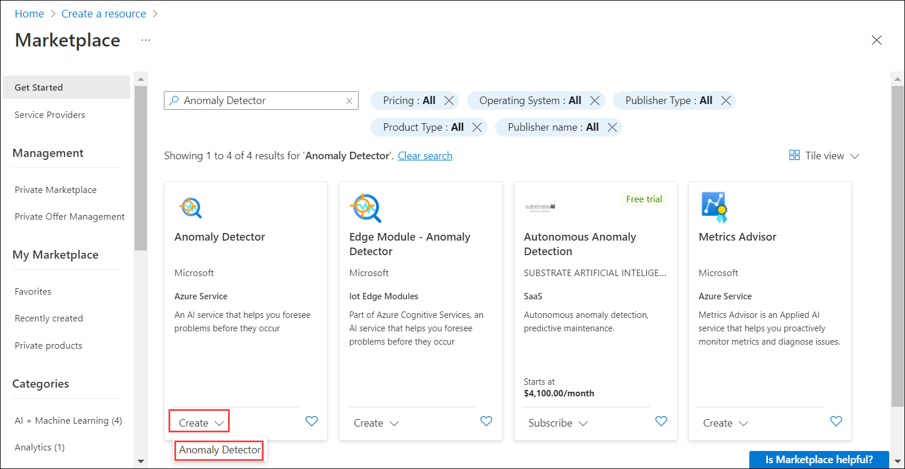
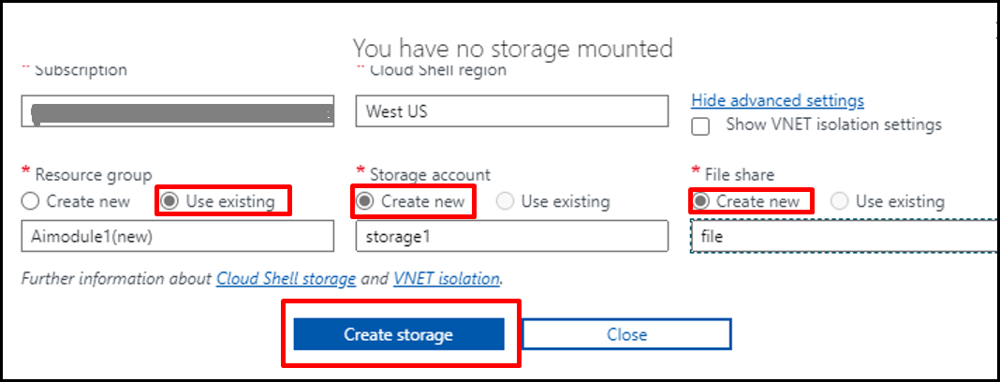
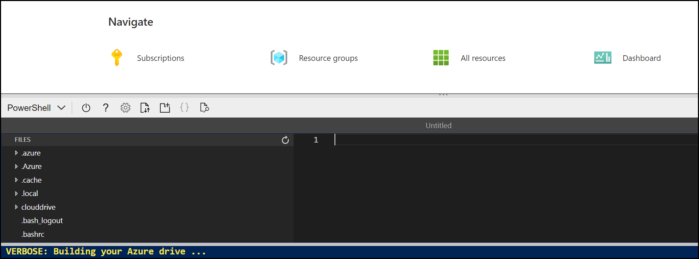

## Explore Cognitive Services

Azure Cognitive Services encapsulate common AI functionality that can be categorized into four main pillars: vision, speech, language, and decision services. In this exercise, you will take a look at one of the decision services to get a general sense of how to provision and use a cognitive services resource in a software application.

The specific cognitive service you'll explore in this exercise is *Anomaly Detector*. An anomaly Detector is used to analyze data values over time, and to detect any unusual values that might indicate a problem or an issue for further investigation. For example, a sensor in a temperature-controlled storage facility might monitor the temperature every minute and log the measured values. You can use the Anomaly Detector service to analyze the logged temperature values and flag any that fall significantly outside of the normal range of expected temperatures.

This exercise is part of a module on Microsoft Learn and requires an Azure subscription. You should use the Azure subscription provided as part of the class.

   **Note**: The goal of this exercise is to get a general sense of how cognitive services are provisioned and used. Anomaly Detector is used as an example, but you are not expected to gain a comprehensive knowledge of anomaly detection in this exercise!

## Exercise 1

### Task 1: Create an Anomaly Detector resource

Let's start by creating an  **Anomaly Detector**  resource in your Azure subscription:

1. In another browser tab, open the Azure portal at  [https://portal.azure.com](https://portal.azure.com/), signing in with your Microsoft account.
    
2.  Click the  **＋Create a resource**  button, search for **Anomaly Detector** and select it.

    
      
3.  Click on **Create** drop down and select **Anomaly Detector**.

    
    
4.  Create **Anomaly Detector** resource with the following settings:
 
    -   **Subscription**:  _Your Azure subscription_.
    -   **Resource group**:  _Select an existing resource group_.
    -   **Name**:  anomaly-[DeploymentID].
    -   **Pricing tier**: Free F0
    
    **Note**:  Replace [DeploymentID] with your DeploymentId, which can be obtained from the Lab Environment Details page.

4.  Click on **Review + create**, and wait for the deployment to complete. Then go to the deployed resource.
    
5.  View the  **Keys and Endpoint**  page for your Anomaly Detector resource. You will need the endpoint and keys to connect from client applications.    
  
### Task 2: Run Cloud Shell

To test the capabilities of the Anomaly Detector service, we'll use a simple command-line application that runs in the Cloud Shell on Azure.

1. In the Azure portal, select the **[>_]** (Cloud Shell) button at the top of the page to the right of the search box. This opens a Cloud Shell pane at the bottom of the portal.

   

2. The first time you open the Cloud Shell, you may be prompted to choose the type of shell you want to use (_Bash_  or  _PowerShell_). Select  **PowerShell**. If you do not see this option, skip the step.

3. When prompted, select **Show advanced settings** and then select **Use existing** and choose existing resource group. Then select **Create new** against Storage account as well as File Share and provide a unique value in both of the fields and then click on **Create storage**, and wait for the Azure Cloud Shell to initialize.

   

4. Make sure the type of shell indicated on the top left of the Cloud Shell pane is switched to  _PowerShell_. If it is  _Bash_, switch to  _PowerShell_  by using the drop-down menu.

   

5. Wait for PowerShell to start. You should see the following screen in the Azure portal:

   

### Task 3: Configure and run a client application

Now that you have a Cloud Shell environment, you can run a simple application that uses the Anomaly Detector service to analyze data.

1. In the command shell, enter the following command to download the sample application and save it to a folder called ai-900.

 
   ```
   git clone https://github.com/MicrosoftLearning/AI-900-AIFundamentals ai-900
   ```

2. The files are downloaded to a folder named **ai-900**. Now we want to see all of the files in your Cloud Shell storage and work with them. Type the following command into the shell:

   ```
   code .
   ```

   Notice how this opens up an editor like the one in the image below:

   

3. In the  **Files**  pane on the left, expand  **ai-900**  and select  **detect-anomalies.ps1**. This file contains some code that uses the Anomaly Detection service, as shown here:

   

4. Don't worry too much about the details of the code, the important thing is that it needs the endpoint URL and either of the keys for your Anomaly Detector resource. Copy these from the  **Keys and Endpoints**  page for your resource (which should still be in the top area of the browser) and paste them into the code editor, replacing the  **YOUR_KEY**  and  **YOUR_ENDPOINT**  placeholder values respectively.

   After pasting the key and endpoint values, the first two lines of code should look similar to this:

   ```
   PowerShell

   $key="1a2b3c4d5e6f7g8h9i0j...."    
   $endpoint="https..."
   ```

5. Click at the top right of the editor pane, to open the menu and select  **Save**  to save your changes. Then open the menu again and select  **Close Editor**.

    

Remember, anomaly detection is an artificial intelligence technique used to determine whether values in a series are within expected parameters. The sample client application will use your Anomaly Detector service to analyze a file containing a series of dates/times and numeric values. The application should return results indicating at each time point, whether the numeric value is within expected parameters.

6. In the PowerShell pane, enter the following commands to run the code:

   ```
   cd ai-900
   .\detect-anomalies.ps1
   ```

7. Review the results, noting that the final column in the results is  **True**  or  **False**  to indicate if the value recorded at each date/time is considered an anomaly or not. Consider how we could use this information in a real-life situation. What action could the application trigger if the values were of fridge temperature or blood pressure and anomalies were detected?

## Learn more
This simple app shows only some of the capabilities of the Anomaly Detector service. To learn more about what you can do with this service, see the  [Anomaly Detector page](https://azure.microsoft.com/services/cognitive-services/anomaly-detector/).
