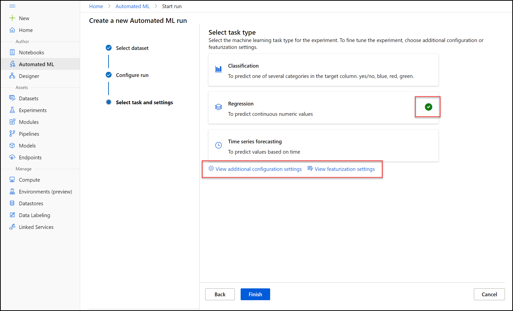
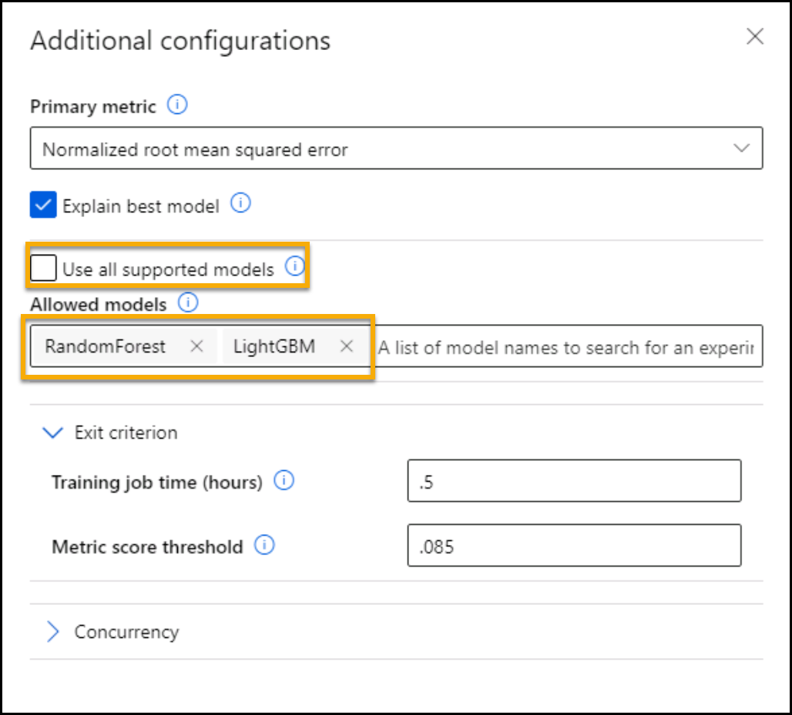
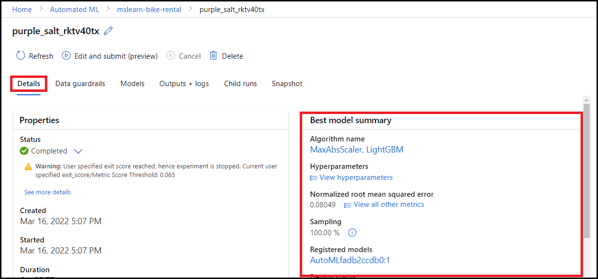
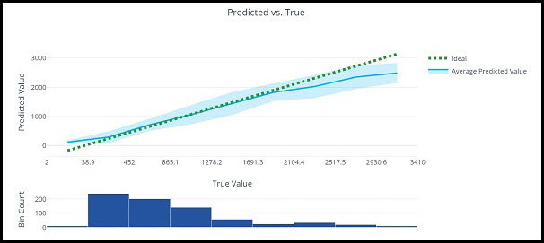
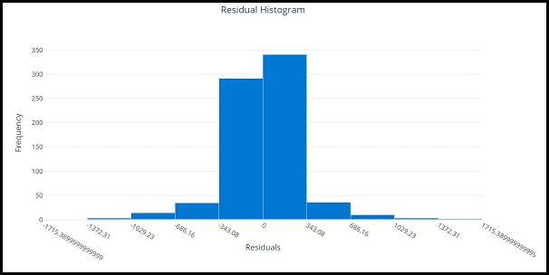

# Explore Machine Learning
Machine learning models are the basis for AI applications. In this lab you will explore Azure Machine Learning and use its automated machine learning feature to train a predictive model.

## Exercise 1 : Create an Azure Machine Learning workspace

Data scientists expend a lot of effort exploring and pre-processing data, and trying various types of model-training algorithms to produce accurate models, which is time consuming, and often makes inefficient use of expensive compute hardware.

Azure Machine Learning is a cloud-based platform for building and operating machine learning solutions in Azure. It includes a wide range of features and capabilities that help data scientists prepare data, train models, publish predictive services, and monitor their usage. Most importantly, it helps data scientists increase their efficiency by automating many of the time-consuming tasks associated with training models; and it enables them to use cloud-based compute resources that scale effectively to handle large volumes of data while incurring costs only when actually used.

### Task 1 : Create an Azure Machine Learning workspace

1.  Sign into the  [Azure portal](https://portal.azure.com/)  using the Microsoft credentials associated with your Azure subscription.
2.  Select  **＋Create a resource**, search for  _Machine Learning_, and create a new  **Machine Learning**  resource the following settings:
    -   **Subscription**:  _Your Azure subscription_
    -   **Resource group**:  _Select an existing resource group_.
    -   **Workspace name**:  workspace_[DeploymentID]
    -   **Region**:  _Select the geographical region closest to you_
    -   **Storage account**:  _Note the default new storage account that will be created for your workspace_
    -   **Key vault**:  _Note the default new key vault that will be created for your workspace_
    -   **Application insights**:  _Note the default new application insights resource that will be created for your workspace_
    -   **Container registry**: None (_one will be created automatically the first time you deploy a model to a container_)

      **Note**:  Replace [DeploymentID] with your DeploymentId and you can be obtained from the Lab Environment output page.

3.  Wait for your workspace to be created (it can take a few minutes). Then go to it in the portal.

4.  On the  **Overview**  page for your workspace, launch Azure Machine Learning studio (or open a new browser tab and navigate to  [https://ml.azure.com](https://ml.azure.com/)), and sign into Azure Machine Learning studio using your Microsoft account. If prompted, select your Azure directory and subscription, and your Azure Machine Learning workspace.

5.  In Azure Machine Learning studio, toggle the ☰ icon at the top left to view the various pages in the interface. You can use these pages to manage the resources in your workspace.

You can manage your workspace using the Azure portal, but for data scientists and Machine Learning operations engineers, Azure Machine Learning studio provides a more focused user interface for managing workspace resources.


## Exercise 2 : Create compute resources

### Task 1 : Create a compute cluster

Compute targets are cloud-based resources on which you can run model training and data exploration processes.

In  [Azure Machine Learning studio](https://ml.azure.com/), view the  **Compute**  page (under  **Manage**). This is where you manage the compute targets for your data science activities. There are four kinds of compute resource you can create:

-   **Compute Instances**: Development workstations that data scientists can use to work with data and models.
-   **Compute Clusters**: Scalable clusters of virtual machines for on-demand processing of experiment code.
-   **Inference Clusters**: Deployment targets for predictive services that use your trained models.
-   **Attached Compute**: Links to existing Azure compute resources, such as Virtual Machines or Azure Databricks clusters.


> **Note**: Compute instances and clusters are based on standard Azure virtual machine images. For this module, the  _Standard_DS11_v2_  image is recommended to achieve the optimal balance of cost and performance. If your subscription has a quota that does not include this image, choose an alternative image; but bear in mind that a larger image may incur higher cost and a smaller image may not be sufficient to complete the tasks. Alternatively, ask your Azure administrator to extend your quota.

1.  Switch to the  **Compute Clusters**  tab, and add a new compute cluster with the following settings. You'll use this to train a machine learning model:
    -   **Location**:  _Select the same as your workspace. If that location is not listed, choose the one closest to you_
    -   **Virtual Machine tier**: Dedicated
    -   **Virtual Machine type**: CPU
    -   **Virtual Machine size**:
        -   Choose  **Select from all options**
        -   Search for and select  **Standard_DS11_v2**
    -   **Compute name**:  _Compute_[DeploymentID]_
    -   **Minimum number of nodes**: 0
    -   **Maximum number of nodes**: 2
    -   **Idle seconds before scale down**: 120
    -   **Enable SSH access**: Unselected

The compute cluster will take some time to be created. You can move onto the next unit while you wait.

## Exercise 3 : Explore data

Machine learning models must be trained with existing data. In this case, you'll use a dataset of historical bicycle rental details to train a model that predicts the number of bicycle rentals that should be expected on a given day, based on seasonal and meteorological features.


### Task 1 : Create a dataset

In Azure Machine Learning, data for model training and other operations is usually encapsulated in an object called a  _dataset_.

1.  View the comma-separated data at  [https://aka.ms/bike-rentals](https://aka.ms/bike-rentals)  in your web browser.
    
2.  In  [Azure Machine Learning studio](https://ml.azure.com/), view the  **Datasets**  page. Datasets represent specific data files or tables that you plan to work with in Azure ML.
    
3.  Create a new dataset  **from web files**, using the following settings:
    
    -   **Basic Info**:
        -   **Web URL**:  [https://aka.ms/bike-rentals](https://aka.ms/bike-rentals)
        -   **Name**: bike-rentals
        -   **Dataset type**: Tabular
        -   **Description**: Bicycle rental data
    -   **Settings and preview**:
        -   **File format**: Delimited
        -   **Delimiter**: Comma
        -   **Encoding**: UTF-8
        -   **Column headers**: Only first file has headers
        -   **Skip rows**: None
        -   **Dataset contains multi-line data**:  _Do not select_
    -   **Schema**:
        -   Include all columns other than  **Path**
        -   Review the automatically detected types
    -   **Confirm details**:
        -   Do not profile the dataset after creation
4.  After the dataset has been created, open it and view the  **Explore**  page to see a sample of the data. This data contains historical features and labels for bike rentals.

## Exercise 4 : Train a machine learning model

Azure Machine Learning includes an automated machine learning capability that automatically tries multiple pre-processing techniques and model-training algorithms in parallel. These automated capabilities use the power of cloud compute to find the best performing supervised machine learning model for your data.


### Task 1 : Run an automated machine learning experiment

In Azure Machine Learning, operations that you run are called  _experiments_. Follow the steps to run an experiment that uses automated machine learning to train a regression model that predicts bicycle rentals.

1.  In  [Azure Machine Learning studio](https://ml.azure.com/), view the  **Automated ML**  page (under  **Author**).
    
2.  Create an Automated ML run with the following settings:
    
    -   **Select dataset**:
        -   **Dataset**: bike-rentals
    -   **Configure run**:
        -   **New experiment name**: mslearn-bike-rental
        -   **Target column**: rentals (_this is the label that the model is trained to predict)_
        -   **Select compute cluster**:  _the compute cluster that you created previously_
    -   **Select task and settings**:
        -   **Task type**: Regression  _(the model predicts a numeric value)_
    
    
    
    Notice under task type there are settings  _View additional configuration settings_  and  _View Featurization settings_. Now configure these settings.
    
    -   **Additional configuration settings:**
        
        -   **Primary metric**: Select  **Normalized root mean squared error**  _(more about this metric later!)_
        -   **Explain best model**: Selected —  _this option causes automated machine learning to calculate feature importance for the best model which makes it possible to determine the influence of each feature on the predicted label._
        -   **Use all supported models**:  Unselected.  _You'll restrict the experiment to try only a few specific algorithms._
        -   **Allowed models**:  _Select only  **RandomForest**  and  **LightGBM**  — normally you'd want to try as many as possible, but each model added increases the time it takes to run the experiment._
        
        
        
        -   **Exit criterion**:
            -   **Training job time (hours)**: 0.5 —  _ends the experiment after a maximum of 30 minutes._
            -   **Metric score threshold**: 0.085 —  _if a model achieves a normalized root mean squared error metric score of 0.085 or less, the experiment ends._
        -   **Concurrency**:  _do not change_
    -   **Featurization settings:**
        -   **Enable featurization**: Selected —  _automatically preprocess the features before training._
    
    Click  **Next**  to go to the next selection pane.
    
    -   **[Optional] Select the validation and test type**
        -   **Validation type**: Auto
        -   **Test dataset (preview)**: No test dataset required
3.  When you finish submitting the automated ML run details, it starts automatically. Wait for the run status to change from  _Preparing_  to  _Running_.
    
4.  When the run status changes to  _Running_, view the  **Models**  tab and observe as each possible combination of training algorithm and pre-processing steps is tried and the performance of the resulting model is evaluated. The page automatically refreshes periodically, but you can also select  **↻ Refresh**. It might take 10 minutes or so before models start to appear, as the cluster nodes must be initialized before training can begin.
    
5.  Wait for the experiment to finish. It might take a while — now might be a good time for a coffee break!
    

### Task 2 : Review the best model

After the experiment has finished you can review the best performing model. In this case, you used exit criteria to stop the experiment. Thus the "best" model the experiment generated might not be the best possible model, just the best one found within the time allowed for this exercise.

1.  On the  **Details**  tab of the automated machine learning run, note the best model summary.
    
    
    
2.  Select the  **Algorithm name**  for the best model to view its details.
    
    The best model is identified based on the evaluation metric you specified,  _Normalized root mean squared error_.
    
    A technique called  _cross-validation_  is used to calculate the evaluation metric. After the model is trained using a portion of the data, the remaining portion is used to iteratively test, or cross-validate, the trained model. The metric is calculated by comparing the predicted value from the test with the actual known value, or label.
    
    The difference between the predicted and actual value, known as the  _residuals_, indicates the amount of  _error_  in the model. The particular performance metric you used, normalized root mean squared error, is calculated by squaring the errors across all of the test cases, finding the mean of these squares, and then taking the square root. What all of this means is that smaller this value is, the more accurate the model's predictions.
    
3.  Next to the  _Normalized root mean squared error_  value, select  **View all other metrics**  to see values of other possible evaluation metrics for a regression model.
    
    
    
4.  Select the  **Metrics**  tab and select the  **residuals**  and  **predicted_true**  charts if they are not already selected.
    
    
    
    Review the charts which show the performance of the model. The chart compares the predicted values against the true values, and shows the  _residuals_, the differences between predicted and actual values, as a histogram.
    
    The  **Predicted vs. True**  chart should show a diagonal trend in which the predicted value correlates closely to the true value. The dotted line shows how a perfect model should perform. The closer the line of your model's average predicted value is to the dotted line, the better its performance. A histogram below the line chart shows the distribution of true values.
    
    
    
    The  **Residual Histogram**  shows the frequency of residual value ranges. Residuals represent variance between predicted and true values that can't be explained by the model, in other words, errors. You should hope to see the most frequently occurring residual values clustered around zero. You want to small errors with fewer errors at the extreme ends of the scale.
    
    
    
5.  Select the  **Explanations**  tab. Select an explanation ID and then select  **Aggregate feature Importance**. This chart shows how much each feature in the dataset influences the label prediction, like this:
    
    

## Exercise 4 : Deploy a model as a service

After you've used automated machine learning to train some models, you can deploy the best performing model as a service for client applications to use.

### Task 1 : Deploy a predictive service

In Azure Machine Learning, you can deploy a service as an Azure Container Instances (ACI) or to an Azure Kubernetes Service (AKS) cluster. For production scenarios, an AKS deployment is recommended, for which you must create an  _inference cluster_  compute target. In this exercise, you'll use an ACI service, which is a suitable deployment target for testing, and does not require you to create an inference cluster.

1.  In  [Azure Machine Learning studio](https://ml.azure.com/), on the  **Automated ML**  page, select the run for your automated machine learning experiment.
    
2.  On the  **Details**  tab, select the algorithm name for the best model.
    
    
    
3.  on the  **Model**  tab, select the  **Deploy**  button and use the  **Deploy to web service**  option to deploy the model with the following settings:
    
    -   **Name**: predict-rentals
    -   **Description**: Predict cycle rentals
    -   **Compute type**: Azure Container Instance
    -   **Enable authentication**: Selected
4.  Wait for the deployment to start - this may take a few seconds. Then, in the  **Model summary**  section, observe the  **Deploy status**  for the  **predict-rentals**  service, which should be  **Running**. Wait for this status to change to  **Successful**, which may take some time. You may need to select  **↻ Refresh**  periodically.
    
5.  In Azure Machine Learning studio, view the  **Endpoints**  page and select the  **predict-rentals**  real-time endpoint. Then select the  **Consume**  tab and note the following information there. If you do not see the  **Consume**  tab, the deployment is not completely finished - you will need to wait and refresh the page. You would need the information from the  **Consume**  tab to connect to your deployed service from a client application.
    
    -   The REST endpoint for your service
    -   The primary or secondary key for your service
    
    
    

### Task 2 : Test the deployed service

Now you can test your deployed service.

1.  On the  **Endpoints**  page, open the  **predict-rentals**  real-time endpoint.
    
2.  When the  **predict-rentals**  endpoint opens, view the  **Test**  tab.
    
3.  In the input data pane, replace the template JSON with the following input data:
    
    JSONCopy
    
    ```
    {
      "Inputs": { 
        "data": [
          {
            "day": 1,
            "mnth": 1,   
            "year": 2022,
            "season": 2,
            "holiday": 0,
            "weekday": 1,
            "workingday": 1,
            "weathersit": 2, 
            "temp": 0.3, 
            "atemp": 0.3,
            "hum": 0.3,
            "windspeed": 0.3 
          }
        ]    
      },   
      "GlobalParameters": 1.0
    }
    
    ```
    
4.  Click on the  **Test**  button.
    
5.  Review the test results, which include a predicted number of rentals based on the input features. The test pane took the input data and used the model you trained to return the predicted number of rentals.
    
    
    

Let's review what you have done. You used a dataset of historical bicycle rental data to train a model. The model predicts the number of bicycle rentals expected on a given day, based on seasonal and meteorological  _features_. In this case, the  _labels_  are number of bicycle rentals.
