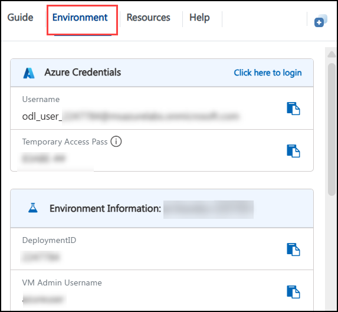
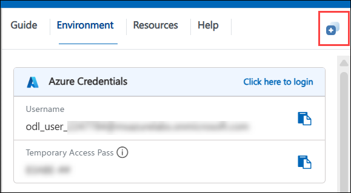
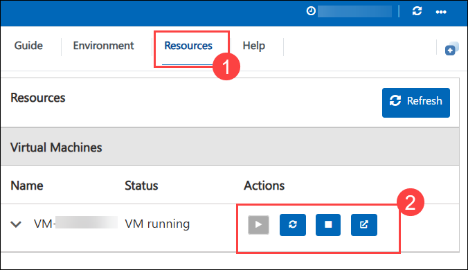
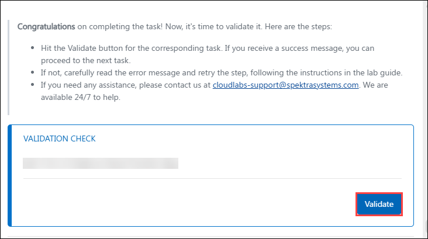
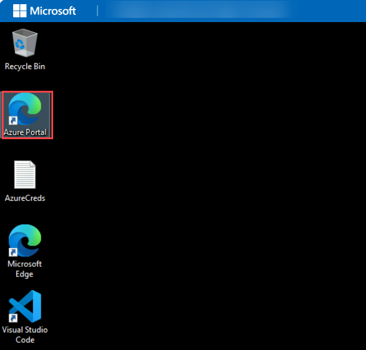
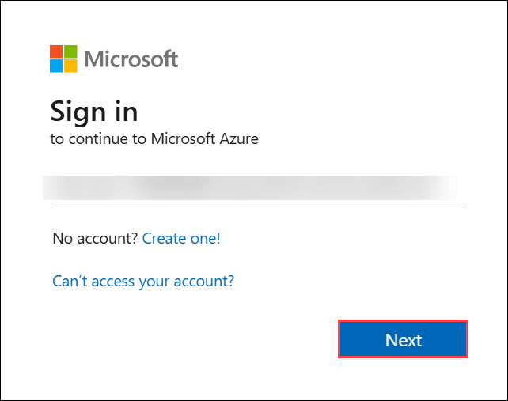
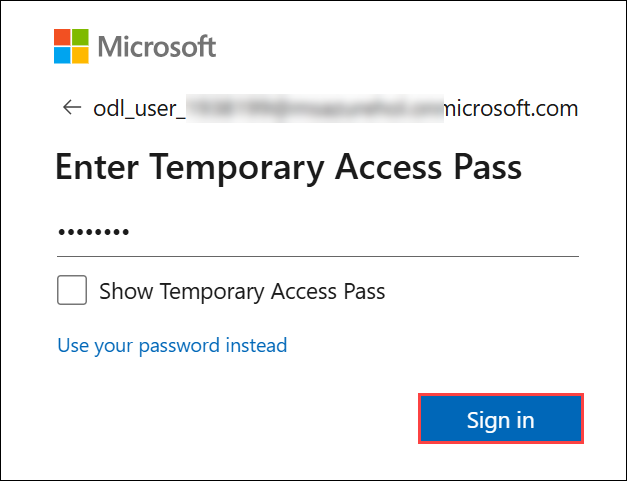
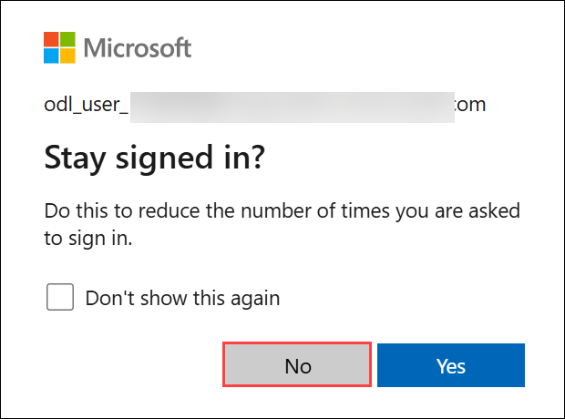
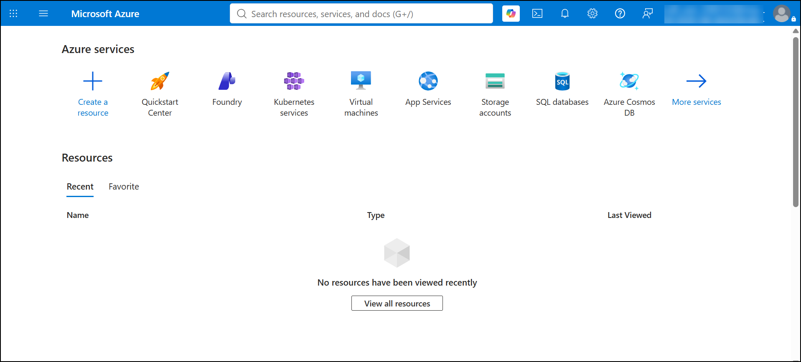

# Hands-on Lab: Explore Knowledge Mining

## 📘 Lab Scenario

You are a **Data & AI Consultant** working with **Fourth Coffee**, a national coffee chain that collects thousands of customer reviews across its stores — some typed online, some scanned from handwritten comment cards, many with photos customers attach of their order or the store itself. Right now, store managers read through these reviews one by one, with no easy way to tell which locations get mentioned most, what customers keep praising or complaining about, or how sentiment is trending over time — so real, actionable signals get buried in the noise. Fourth Coffee has asked you to design and build a knowledge mining solution using **Azure AI Search** that automatically reads every review the moment it's uploaded, extracts the insights hidden inside it, and makes all of it instantly searchable and filterable.

## 📖 Overview

In this hands-on lab, you'll provision the Azure resources behind a knowledge mining solution, then use Azure AI Search to turn a folder of raw customer review documents into a searchable, AI-enriched index. You'll run the **Import data** wizard to apply built-in AI skills (OCR, location extraction, key phrase extraction, and image tagging/captioning), extend the generated skillset by hand to add sentiment analysis and a knowledge store, and finish by querying the index and reviewing the enriched results in Azure Storage.

## 🎯 Objectives

- **Create Azure resources:** Provision an Azure AI Search resource, a Foundry resource (for AI enrichment), and a Storage account.
- **Upload documents:** Load the Fourth Coffee customer review files into an Azure Blob Storage container.
- **Build an AI-enriched index:** Use the Import data wizard's Keyword search scenario to extract locations, key phrases, and image tags/captions from the reviews.
- **Extend the skillset:** Edit the generated skillset's JSON definition to add sentiment analysis and a knowledge store, since the wizard no longer exposes these as checkboxes.
- **Query the index:** Use Search explorer to filter reviews by location and by sentiment.
- **Review the knowledge store:** Browse the enriched tables, objects, and images saved to your storage account.

## ⚙️ Prerequisites

Participants should have:

- Basic understanding of navigating the Azure portal.
- Familiarity with the general idea of search indexing; no prior Azure AI Search experience is required.

## 🏗️ Architecture

This lab runs one indexing pipeline with two outputs. Customer review documents land in an Azure Storage container. An indexer, part of Azure AI Search, pulls those documents in and runs them through a skillset, which calls a Foundry resource to perform AI enrichment — OCR, location extraction, key phrase extraction, image tagging, and sentiment. The same enriched results are then saved two ways: into a searchable index for instant querying, and into a knowledge store back in the same storage account, as plain tables, JSON objects, and images.

## 🖼️ Architecture diagram

## 🔍 Explanation of Components

- **Azure AI Search:** The service that holds your searchable index and runs the pipeline that builds it. Formerly known as *Azure Cognitive Search*.
- **Foundry resource:** Supplies the AI building blocks (OCR, entity/location extraction, key phrase extraction, image tagging, sentiment) used to enrich your documents. Formerly known as *Cognitive Services* or *Azure AI services*.
- **Storage account:** Holds the raw customer review documents you upload, and also holds the knowledge store — the enriched data saved as tables, JSON files, and images.
- **Skillset:** The list of AI enrichment steps ("skills") that run on each document during indexing.
- **Indexer:** The automated job that reads documents from storage, runs the skillset on them, and loads the results into the search index.
- **Index:** The searchable, structured copy of your documents — including the AI-enriched fields — that you query in Search explorer.
- **Knowledge store:** A second copy of the enriched data, saved into your storage account so tools other than Azure AI Search can use it too.

## 🚀 Getting Started with the Lab

We've prepared a seamless environment for you to explore and learn about Azure AI Search and knowledge mining. Let's begin by making the most of this experience.

### Accessing Your Lab Environment

1. Once the environment is provisioned, a virtual machine (JumpVM) and lab guide will get loaded in your browser. Use this virtual machine throughout the lab. You can see the number on the lab guide's bottom area to switch between exercises.

    

1. To get the lab environment details, select the **Environment Details** tab. Credentials are also emailed to the address you provided during registration.

    

### Lab Guide Zoom In/Zoom Out

To adjust the zoom level for the environment page, click the **A↕: 100%** icon located next to the timer in the lab environment.

### Utilizing the Split Window Feature

For convenience, you can open the lab guide in a separate window by selecting the **Split Window** button.

### Managing Your Virtual Machine

Feel free to **Start, Stop, or Restart (2)** your virtual machine as needed from the **Resources (1)** tab. Your experience is in your hands!

### Lab Validation

1. After completing a task, hit the **Validate** button under the Validation tab integrated into your lab guide. You can proceed to the next task if you receive a success message. If not, carefully read the error message and retry the step, following the instructions in the lab guide.

    

1. If you need any assistance, please contact us at cloudlabs-support@spektrasystems.com. We are available 24/7 to help you out.

## Login to Azure Portal

1. In the JumpVM, click on Azure portal shortcut of Microsoft Edge browser which is created on desktop.

   

1. On **Sign into Microsoft Azure** tab you will see login screen, in that enter following email/username and then click on **Next**.
   
   - **Email/Username:** <inject key="AzureAdUserEmail"></inject>

        

1. Now enter the following password and click on **Sign in**.
   
   - **Password:** <inject key="AzureAdUserPassword"></inject>

        

1. If you see the pop-up **Stay Signed in?**, click No

    

1. If you see the pop-up **You have free Azure Advisor recommendations!**, close the window to continue the lab.

1. If a **Welcome to Microsoft Azure** popup window appears, click **Maybe Later** to skip the tour.

1. Now you will see **Azure Portal** home page.

    

## 📞 Support Contact

The support team is available 24/7 to ensure seamless assistance at any time.

- Email Support: [cloudlabs-support@spektrasystems.com](mailto:cloudlabs-support@spektrasystems.com)
- Live Chat Support: https://cloudlabs.ai/labs-support

Now, click on the **Next** from lower right corner to move on to the next page.

