# Lab 01: Analyze images with Azure AI Computer Vision

## Estimated Duration: 60 Minutes

## Overview

The Computer Vision Azure AI service uses pre-trained machine learning models to analyze images and extract information about them.

For example, suppose the fictitious retailer Northwind Traders has decided to implement a "smart store" in which AI services monitor the store to identify customers requiring assistance and direct employees to help them. By using the Computer Vision service, images taken by cameras throughout the store can be analyzed to provide meaningful descriptions of what they depict.

## Lab Objectives

You will be able to complete the following tasks:

  - Task 1: Create an Azure AI Services resource
  - Task 2: Run Cloud Shell
  - Task 3: Configure and run a client application

## Task 1: Create an Azure AI Services resource

In this task, you will create an Azure AI Services resource in the Azure portal and retrieve its keys and endpoint for integration.

1. In the Azure Portal, select the **&#65291;Create a resource** button, search for *Azure AI services*, and select it.

   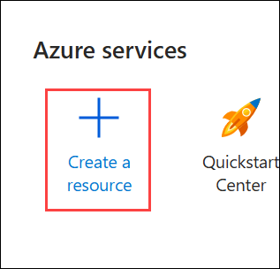

1. In the **Create a resource** page: Enter **Azure AI services (1)** in the search bar. From the results, select **azure ai services (2)** from the dropdown list..

    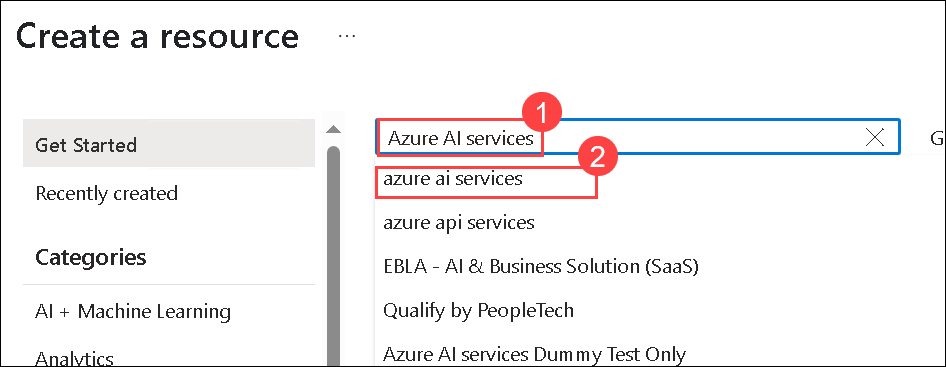

1. Select **Create (1)** drop down under **Azure AI services** and select **Azure AI services (2)**.

   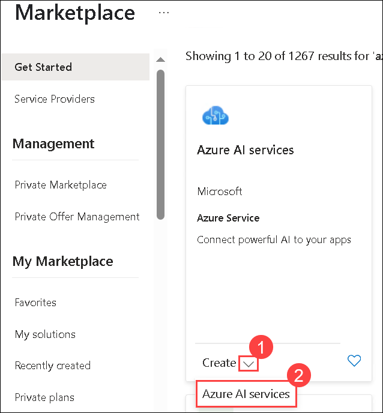

1. On the **Create Azure AI services** tab, under **Project Details**, provide the following settings:

    - Subscription: **Your Azure subscription (1)**
    - Resource group: Select **ai-service-<inject key="DeploymentID" enableCopy="false"/>** **(2)**
    - Region:  **<inject key="Region" enableCopy="false"/>** **(3)**
    - Name: Enter **aiservice-<inject key="DeploymentID" enableCopy="false"/>** **(4)**
    - Pricing tier: **Standard S0** **(5)**
    - **By checking this box I acknowledge that I have read and understood all the terms below**: Selected **(6)**

    - Click **Review + create** **(7)**

      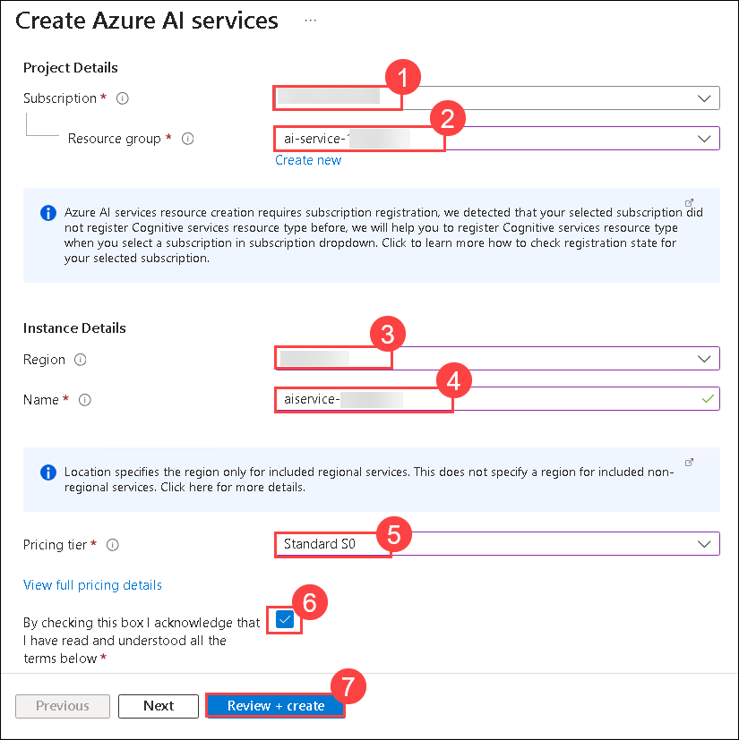

1. After successfully completing the validation process, click on the **Create** button located in the lower-left corner of the page.

    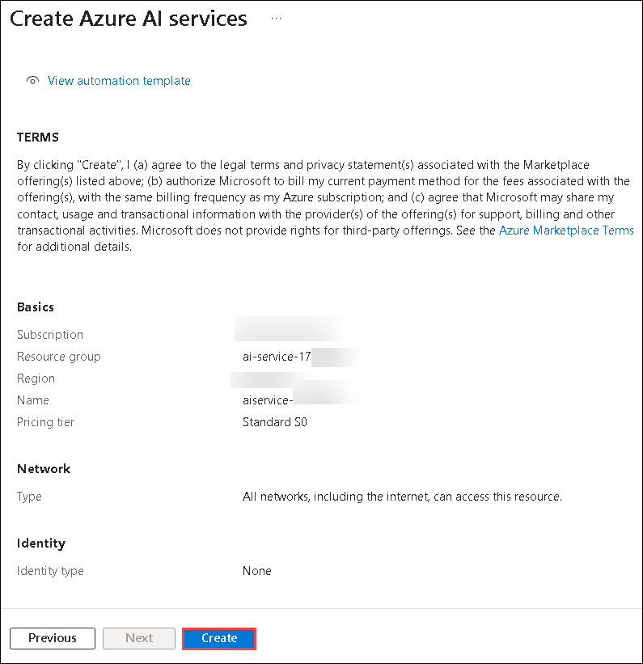

1. Wait for deployment to complete(it can take a few minutes), and then click on the **Go to resource** button, which will take you to your resource group.

    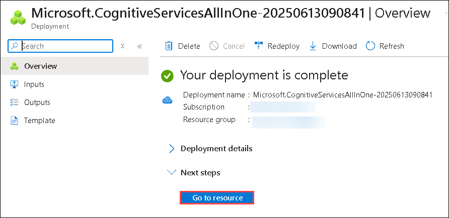

1. From the resource group overview, select the **aiservice-<inject key="DeploymentID" enableCopy="false"/>** resource listed under the **Name** column.

    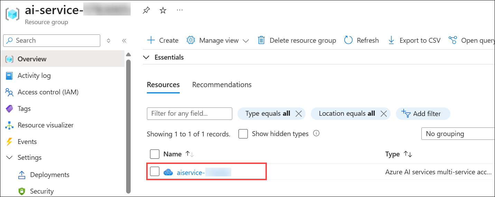

1. Navigate to the **Keys and Endpoint (1)** page from the left pane under **Resource Management** for your Azure AI services resource. You will need the endpoint and keys to connect from client applications.  Copy and paste the **KEY 1 (2)** and **Endpoint (3)** values to Notepad for future reference to connect from client applications.

    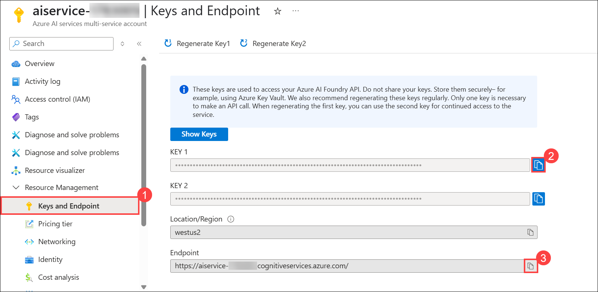

## Task 2: Run Cloud Shell

In this task, you will set up Azure Cloud Shell with PowerShell to prepare the environment for running the client application.

1. In the Azure portal, select the **[>_]** (*Cloud Shell*) button at the top of the page to the right of the search box. This opens a Cloud Shell pane at the bottom of the portal.

    .png)

1. The first time you open the Cloud Shell, you may be prompted to choose the type of shell you want to use (*Bash* or *PowerShell*). Select **PowerShell**. If you do not see this option, skip the step.  

    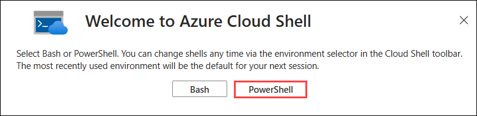

    >**Note:** If you are not able to see the **[\>_]** button, click on the **ellipses(...) (1)** to the right of the search bar at the top of the page and then select **Cloud Shell  **[>_]** (2)** from the drop down options.

    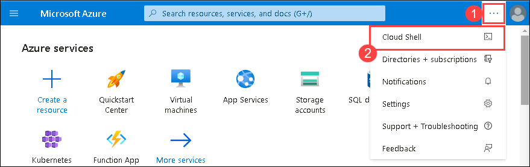

1. On the Getting started, select **Mount storage account (1)** and select your **subscription(2)** under Storage account subscription . Click on **Apply (3)**.

   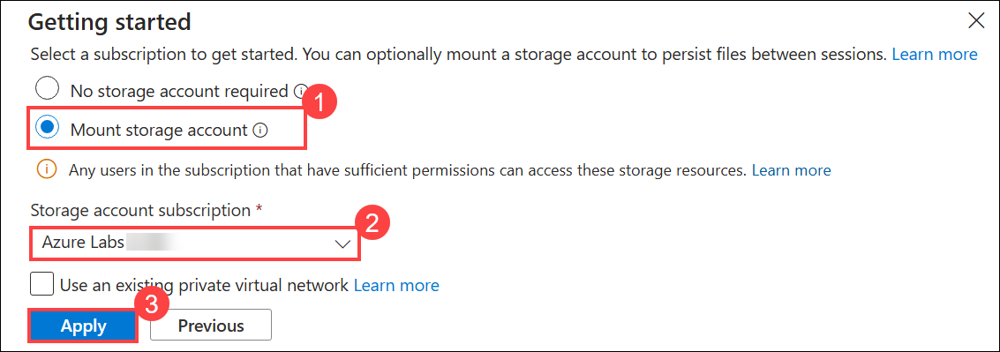

1. On the Mount storage account tab, select **I want to create a storage account (1)**. Click on **Next (2)**.

    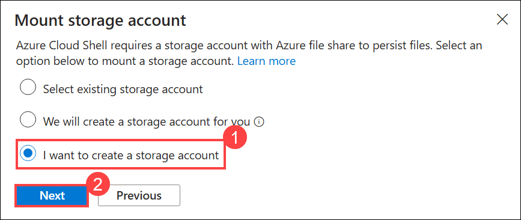

1. On the Create storage account tab, provide the details and select **Create (6)**

    | Settings | Values |
    |  -- | -- |
    | Subscription | **Existing subscription (1)**|
    | Resource group | **ai-service-<inject key="DeploymentID" enableCopy="false"/> (2)**|
    | Region | **<inject key="Region" enableCopy="false"/> (3)**|
    | Storage account name | **blob<inject key="DeploymentID" enableCopy="false"/> (4)**|
    | File share | **none (5)**|

    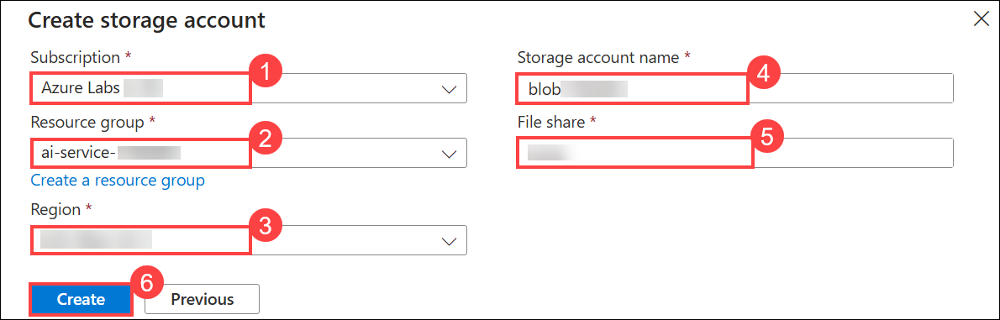

1. You can see a pop-up appearing **Deployment is in Progress**, wait for the PowerShell terminal to start.

   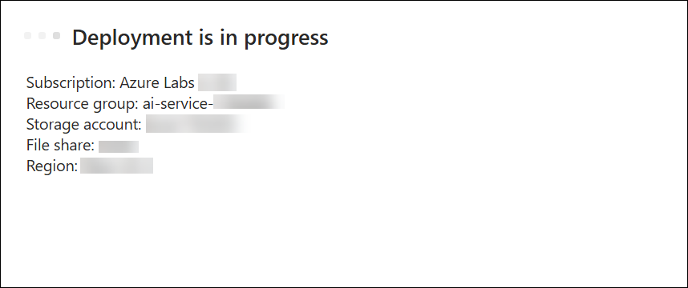
   
1. Make sure the type of shell indicated on the top left of the Cloud Shell pane is **Switch to Bash**. If it is *Switch to PowerShell*, select it to switch to PowerShell.

    

1. Wait for PowerShell to start. You should see the following screen in the Azure portal:  

    

## Task 3: Configure and run a client application

In this task, you will modify a sample client application with your resource details and use it to analyze images with the Computer Vision service.

1. In the command shell, enter the following command to download the sample application and save it to a folder called **ai-search**.

    ```PowerShell
    git clone https://github.com/CloudLabs-MOC/AI-900-AIFundamentals ai-search
    ```

     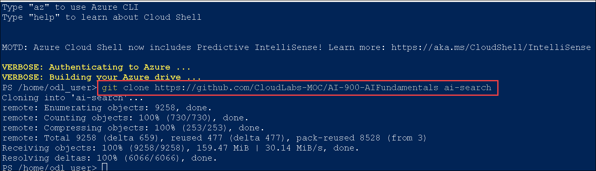    

1. The files are downloaded to a folder named **ai-search**. Now we want to see all of the files in your Cloud Shell storage and work with them. Type the following command into the shell:

    ```PowerShell
    code .
    ```
   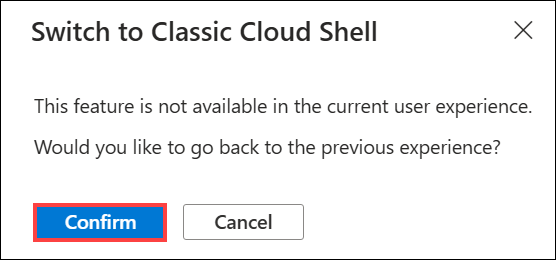

   >**Note**: If you get Switch to Classic Cloud Shell, click on **Confirm** and run the previous command again.

    Notice how this opens up an editor like the one in the image below:

    .png)

1. If the code editor is not opened, please re-enter the below command **(1)**, then you will be to see the code editor **(2)**. 

    ```PowerShell
    code .
    ```

     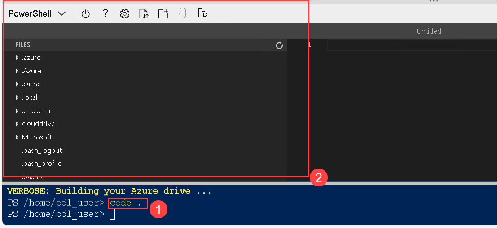        

1. In the **Files** pane on the left, expand **ai-search (1)** and select **analyze-image.ps1 (2)**. This file contains some code that uses the Computer Vision service to analyze an image, as shown here:

    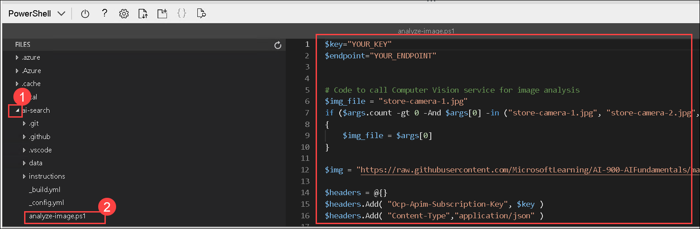

1. Don't worry too much about the code; the important thing is that it needs the endpoint URL and either of the keys for your Azure AI service resource. Use the Keys and Endpoint that you have copied earlier in **Task 1**.

1. Replace the **YOUR_KEY** with **KEY 1 (1)** and **YOUR_ENDPOINT** with **Endpoint (2)** value of the AI Service that you have copied in the previous task.

    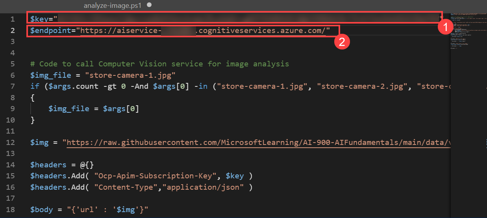

     >**Tip:** You may need to use the separator bar to adjust the screen area as you work with the **Keys and Endpoint** and **Editor** panes.
   
1. After making the changes to the variables in the code, press **CTRL+S** to save the file. 

1. The sample client application will use your Computer Vision service to analyze the following image, taken by a camera in the Northwind Traders store:

    

    In the PowerShell terminal pane, enter the following commands to run the code:

    ```PowerShell
    cd ai-search
    ```

     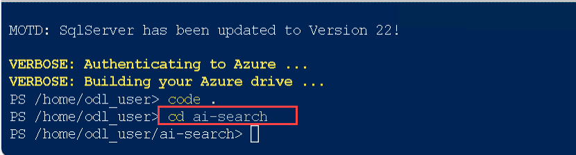    
    
    ```PowerShell
    ./analyze-image.ps1 store-camera-1.jpg
    ```

1. Review the results of the image analysis, which include:
    - A suggested caption that describes the image.
    - A list of objects identified in the image.
    - A list of "tags" that are relevant to the image.

      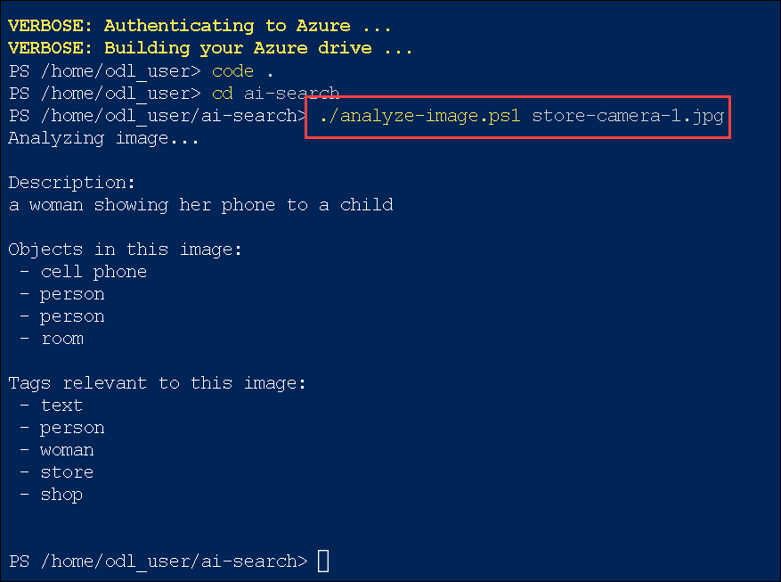     

1. Now let's try another image:

    

    To analyze the second image, enter the following command:

    ```PowerShell
    ./analyze-image.ps1 store-camera-2.jpg
    ```

1. Review the results of the image analysis for the second image.

    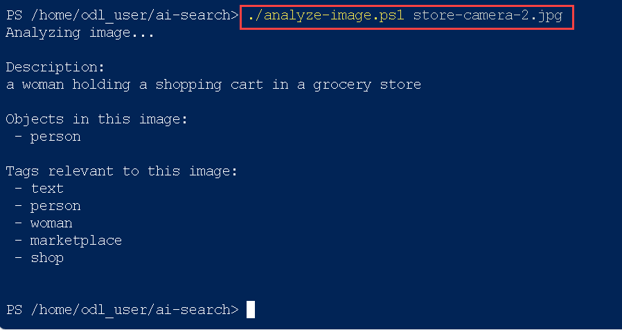

1. Let's try one more:

    

    To analyze the third image, enter the following command:

    ```PowerShell
    ./analyze-image.ps1 store-camera-3.jpg
    ```

1. Review the results of the image analysis for the third image.

    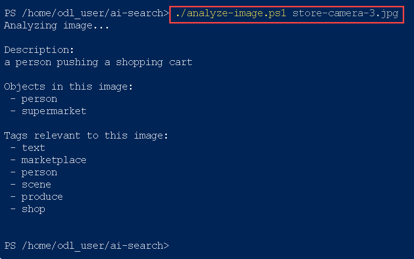

<validation step="e2c31f6e-21a8-4d12-a1dd-4484dbf76091" />

## Summary

In this lab, you have covered the following:
  
-    Explored the Azure AI Services resource configuration.
-    Set up and utilized Azure Cloud Shell.
-    Configured and executed a client application for image analysis.

### You have successfully completed the lab. Click on Next from the bottom right corner.
