# Lab 03: Analyze images with Azure AI Face API

## Estimated Duration: 60 Minutes

## Overview

Computer vision solutions often require an artificial intelligence (AI) solution to be able to detect human faces. For example, suppose the retail company Northwind Traders wants to locate where customers are standing in a store to best assist them. One way to accomplish this is to determine if there are any faces in the images, and if so, to identify the bounding box coordinates around the faces.

To test the capabilities of the Face service, we'll use a simple command-line application that runs in the Cloud Shell. The same principles and functionality apply in real-world solutions, such as websites or phone apps.

## Lab Objectives

You will be able to complete the following tasks:

  - Task 1: Create a Face API resource
  - Task 2: Configure and run a client application

## Task 1: Create a Face API resource

You can use the Face service by creating a **Face** resource. (Face API is no longer available in Azure AI Services)

1. In the Azure portal, click the **&#65291;Create a resource** button.

    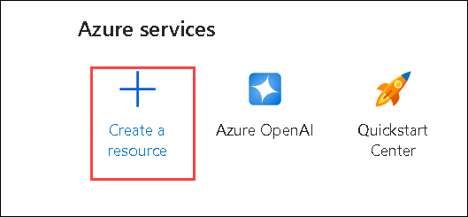

1. In the **Create a resource** page, type **face (1)** into the search bar. From the results, select **face (2)** under the available services.

    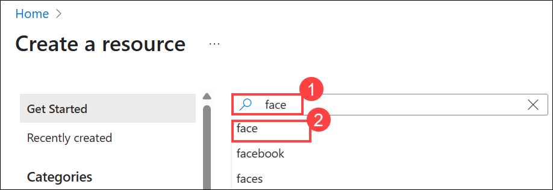

1. In the **Face** service card, click on the **Create** **(1)** dropdown, then select **Face (2)** from the list.

    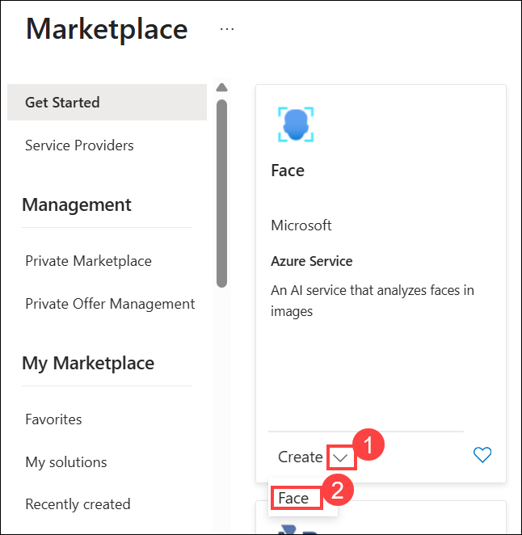

1. Create a **Face** resource by entering the following details under **Project Details**: 

    - Subscription: **Use existing Azure subscription** **(1)**
    - Resource group: **ai-service-<inject key="DeploymentID" enableCopy="false"/> (2)**
    - Region:  **<inject key="Region" enableCopy="false"/> (3)**
    - Name: Enter **aiface-<inject key="DeploymentID" enableCopy="false"/> (4)**
    - Pricing tier: **Standard S0 (5)**

   Once all fields are filled, click **Review + create (6)** to proceed.
   
   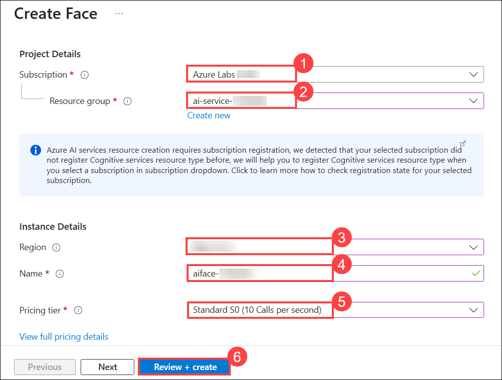
   
1. After successfully completing the validation process, click on the **Create** button located in the lower-left corner of the page.

    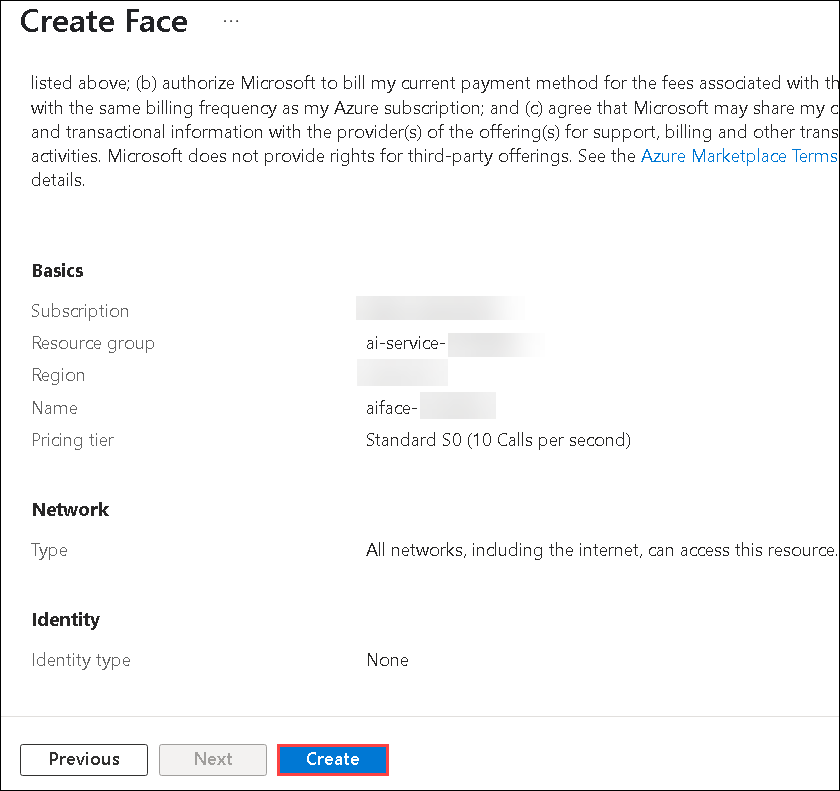
   
1. Wait for deployment to complete(it can take a few minutes), and then click on the **Go to resource** button; this will take you to your Resource group.

    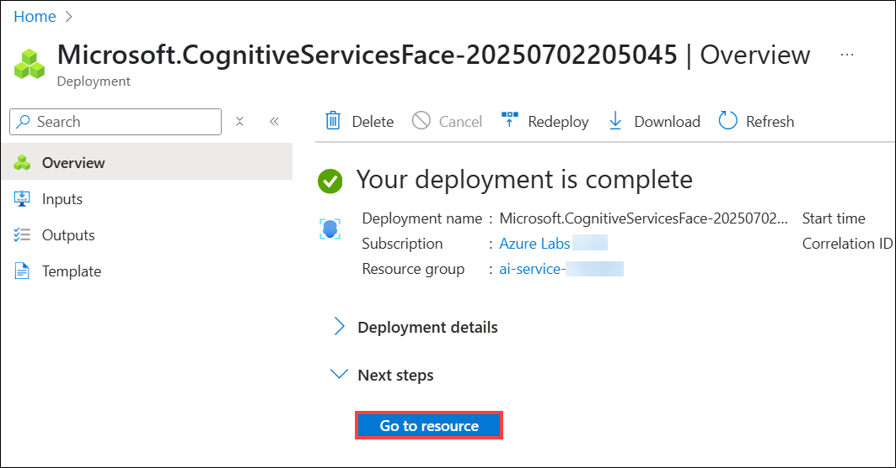

1. From the resource group overview, select the **aiface-<inject key="DeploymentID" enableCopy="false"/>** resource under the **Name** column with the type **Face API**.

    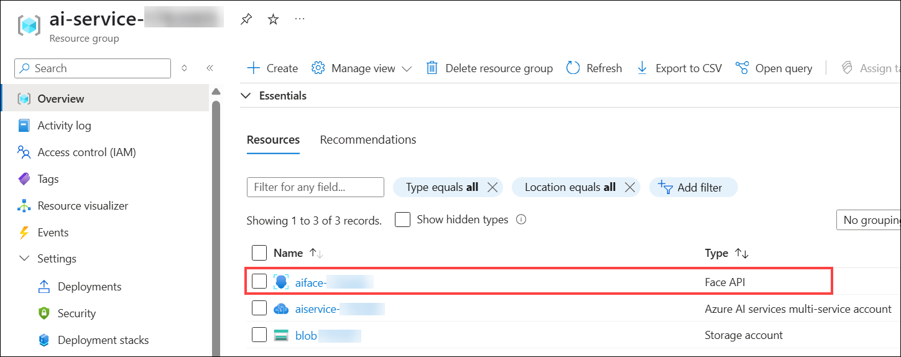

1. Select **Keys and Endpoint (1)** under **Resource Management** for your Face resource. Click on **Show keys**, you will need the endpoint and keys to connect from client applications. Copy and save the **KEY 1 (2)** and **Endpoint (3)** value to Notepad for future reference to connect from client applications. 

    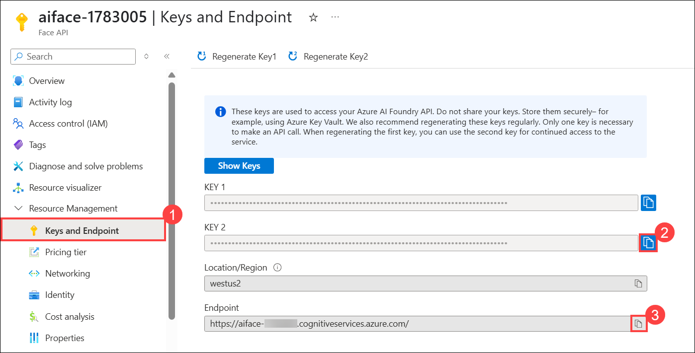


## Task 2: Configure and run a client application

To test the capabilities of the Face service, we'll use a simple command-line application that runs in the Cloud Shell on Azure. 

1. In the same cloud-shell window from the previous lab, if the code editor is not opened, enter the following command:

    ```PowerShell
    code .
    ```

1. Now that you have a custom model, you can run a simple client application that uses the Face service.

1. The files are downloaded in the folder named **ai-search**. Now we want to see all of the files in your Cloud Shell storage and work with them. 

1. In the **Files** pane on the left, expand **ai-search (1)** and select **find-faces.ps1 (2)**. This file contains some code that uses the Face service to detect and analyze faces in an image, as shown here:

    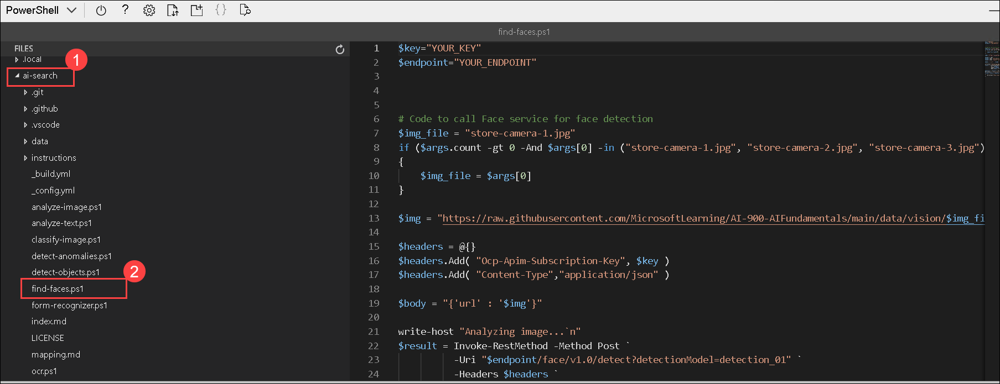

1. Don't worry too much about the details of the code; the important thing is that it needs the endpoint URL and either of the keys for your Face resource.

1. Replace the **YOUR_KEY** with **KEY 1 (1)** and **YOUR_ENDPOINT** with **Endpoint (2)** placeholder values, respectively, that you had copied in the previous task.

    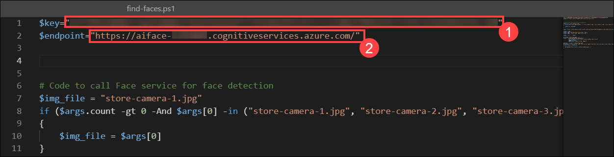

    > **Tip**: You may need to use the separator bar to adjust the screen area as you work with the **Keys and Endpoint** and **Editor** panes.

1. After making the changes to the variables in the code, press **CTRL+S** to save the file.

    The sample client application will use your Face service to analyze the following image, taken by a camera in the Northwind Traders store:

    

1. Make sure you are in the **ai-search** folder. If not, run the below command to move into the folder.

    ```PowerShell
    cd ai-search
    ```

1. In the PowerShell pane, enter the following commands to run the code:

     ```PowerShell
    ./find-faces.ps1 store-camera-1.jpg
    ```

1. Review the returned information, which includes the location of the face in the image. The location of a face is indicated by the top-left coordinates, and the width and height of a *bounding box*, as shown here:
    
    
    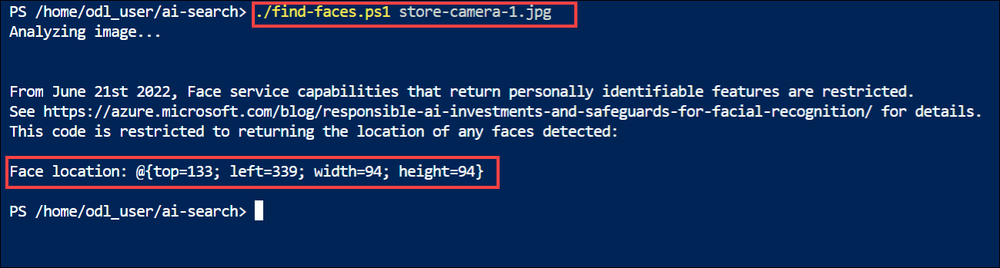
    >**Note:** Face service capabilities that return personally identifiable features are restricted. See https://azure.microsoft.com/blog/responsible-ai-investments-and-safeguards-for-facial-recognition/ for details.

1. Now let's try another image:

    

    To analyze the second image, enter the following command:

    ```PowerShell
    ./find-faces.ps1 store-camera-2.jpg
    ```

1. Review the results of the face analysis for the second image.

   
   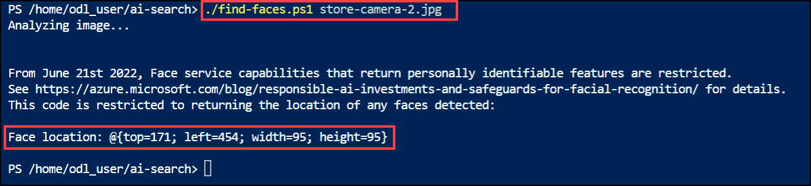

1. Let's try one more:

    

    To analyze the third image, enter the following command:

    ```PowerShell
    ./find-faces.ps1 store-camera-3.jpg
    ```

1. Review the results of the face analysis for the third image.

   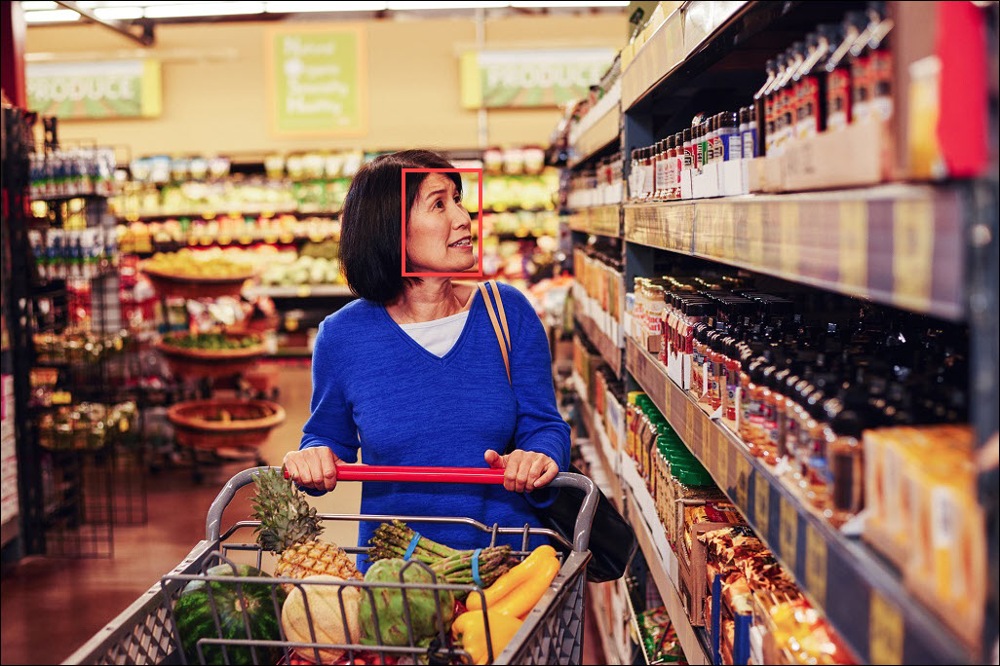
   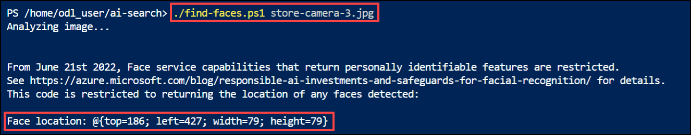

> **Congratulations** on completing the task! Now, it's time to validate it. Here are the steps:
> - If you receive a success message, you can proceed to the next task.
> - If not, carefully read the error message and retry the step, following the instructions in the lab guide. 
> - If you need any assistance, please contact us at cloudlabs-support@spektrasystems.com. We are available 24/7 to help you out.

<validation step="481c05b1-591f-4f2d-b178-8e886446aa22" />

## Summary

In this lab, you have covered the following:
  
  - Created a Face API resource
  - Configured and run a client application

## Learn more

This simple app shows only some of the capabilities of the Face service. To learn more about what you can do with this service, see the [Face API page](https://learn.microsoft.com/en-us/azure/ai-services/computer-vision/overview-identity).

## You have successfully completed the lab. Click on Next from the bottom right corner.

