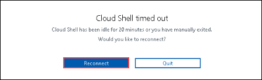
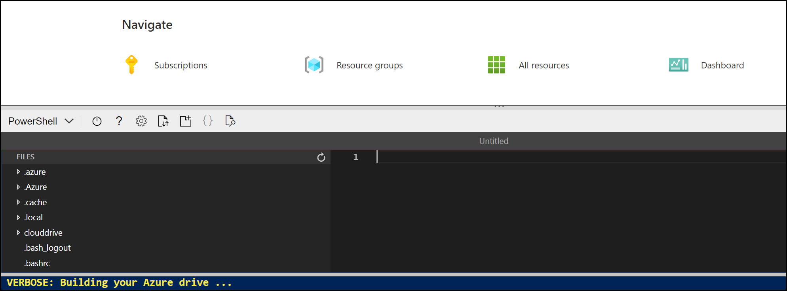
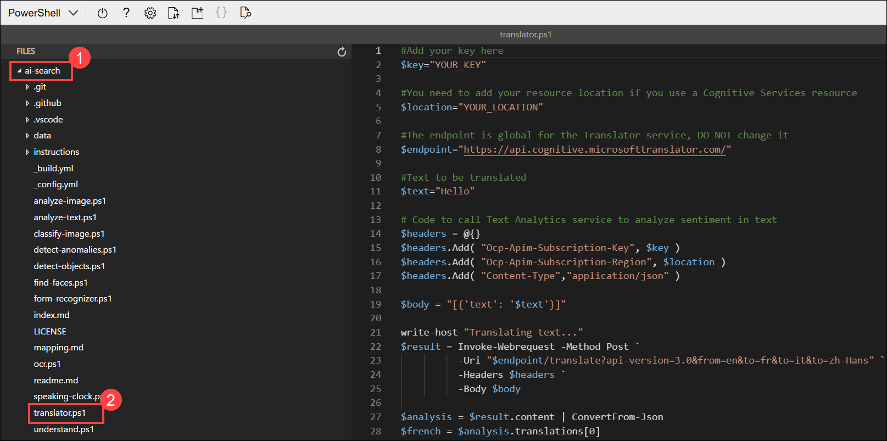
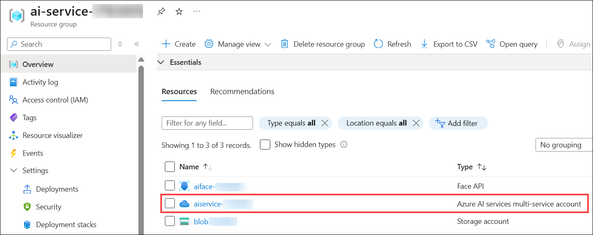
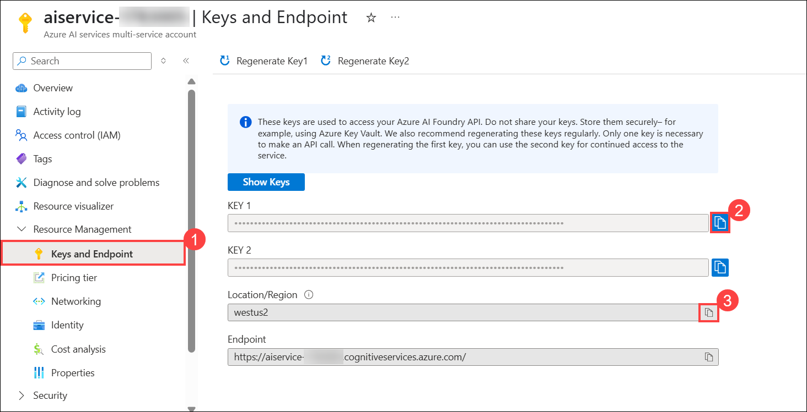
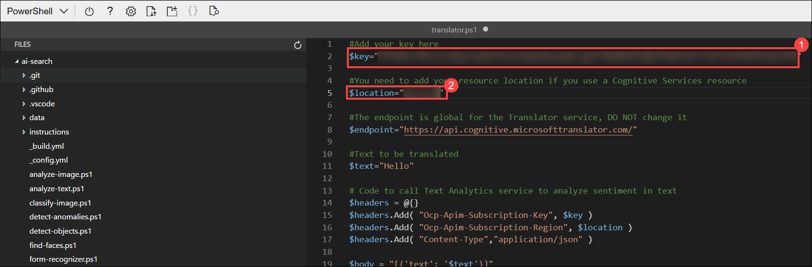
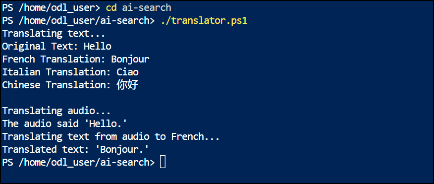

# Lab 04: Translate text and audio with Azure AI Translator

## Estimated Duration: 60 Minutes

## Overview

One of the driving forces that has enabled human civilization to develop is the ability to communicate with one another. In most human endeavors, communication is key.

Artificial Intelligence (AI) can help simplify communication by translating text or speech between languages, helping to remove barriers to communication across countries and cultures.

To test the capabilities of the Translator service, we'll use a simple command-line application that runs in the Cloud Shell. The same principles and functionality apply to real-world solutions, such as websites or phone apps.

## Lab Objectives

You will be able to complete the following tasks:

  - Task 1: Configure and run a client application

## Task 1: Configure and run a client application

To test the capabilities of the Translation service, we'll use a simple command-line application that runs in the Cloud Shell on Azure. 

1. Close the code editor if you have it already open.

1. Switch back to the browser tab containing the Azure portal, where the **Cloud shell** (**[>_]**) is already opened.

    .png)

1. If you see the Cloud Shell timed-out window, select **Reconnect**; otherwise, proceed with the next Task.

    

    Now that you have a custom model, you can run a simple client application that uses the Translation service.

1. The required files are downloaded to a folder named **ai-search** in the previous lab. Now we want to see all of the files in your Cloud Shell storage and work with them. Type the following command into the shell: 

    ```PowerShell
    code .
    ```

    Notice how this opens up an editor like the one in the image below: 

    

1. If the code editor is not opened, please re-enter the below command **(1)**, and then you will be able to see the code editor **(2)**. 

    ```PowerShell
    code .
    ```

          

1. In the **Files** pane on the left, expand **ai-search (1)** and select **translator.ps1 (2)**. This file contains some code that uses the Translator service:

    

1. Don't worry too much about the details of the code; the important thing is that it needs the region/location and either of the keys for your Azure AI Services resource. 

1. Navigate to **ai-service-<inject key="DeploymentID" enableCopy="false"/>**, In the resource group, select the **aiservice-<inject key="DeploymentID" enableCopy="false"/>**  resource with the type **Azure AI services multi-service account**.

   
   
1. In the left menu, go to **Keys and Endpoints (1)**. copy the values of **KEY 1 (2)** and **Location/Region (3)** value from the **Keys and Endpoints** page. Paste them into the code editor.
   
      

    > **Note:** The Translator service does not require the use of the Azure AI Service endpoint, so there is no need to modify the Translator service endpoint. Instead, a dedicated global endpoint is available specifically for the Translator service. 

1. Replace **YOUR_KEY** with **KEY 1 (1)** value and **YOUR_LOCATION** with **Location/Region (2)** value, respectively. That you had copied in the previous step.

    

1. Press **Ctrl+S** to save the changes that have been made. Press **Ctrl+Q** to close the code editor window.

1. Make sure you are in the **ai-search** folder. If not, run the below command to move into the folder.

    ```PowerShell
    cd ai-search
    ```
    
1. In the Cloud Shell pane, enter the following command to run the code:

    ```PowerShell
    ./translator.ps1
    ```

1. Review the output. Did you see the translation from the text in English to French, Italian, and Chinese?  Did you see the English audio "hello" translated into text in French?

    

### Summary

In this lab, you have covered the following:
  - Configured and run a client application

### Learn more

This simple app shows only some of the capabilities of the Translator service. To learn more about what you can do with this service, see the [Translator page](https://learn.microsoft.com/en-us/azure/ai-services/translator/).

## Conclusion

In this lab **Getting started with Azure AI services**, we explored the end-to-end workflow of using Azure AI Services. We began by creating and configuring AI resources, running applications through Cloud Shell, and integrating them with client applications. We then worked with Custom Vision, where we created a project, added and tagged images, trained and tested a model, and published it for real world use. Additionally, we implemented the Face API and validated its functionality through a client application. We configured and ran a client application using Azure AI Translator to translate text and audio across languages. Overall, this hands-on experience demonstrated how Azure AI services can be effectively leveraged to build, train, deploy, and test intelligent applications with ease and scalability.

### You have successfully completed the lab.


