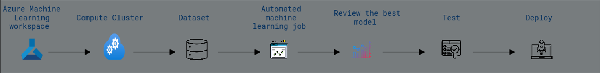
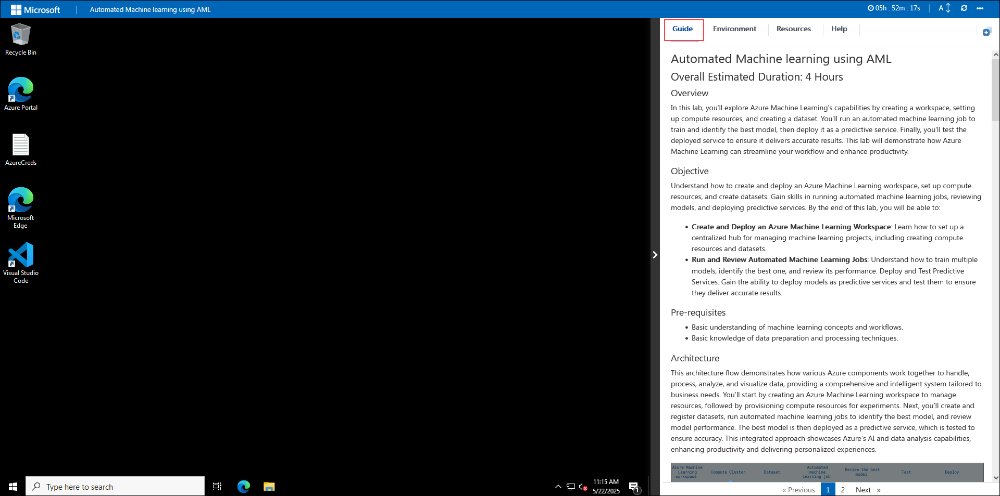
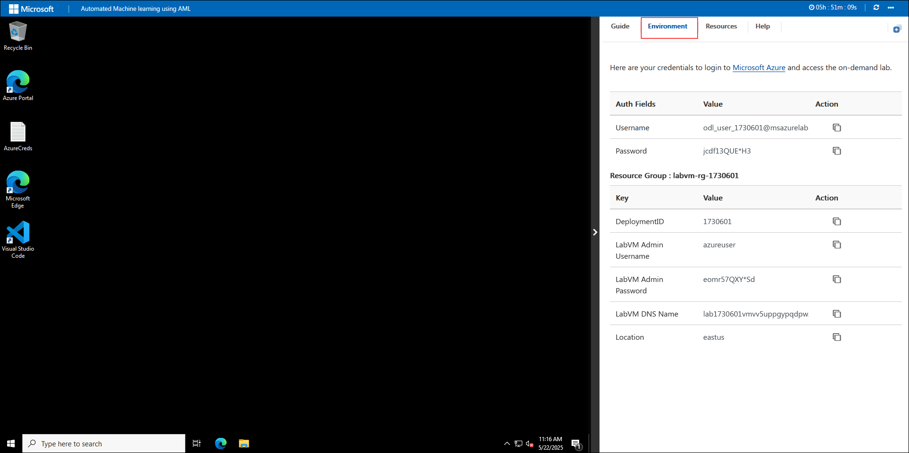
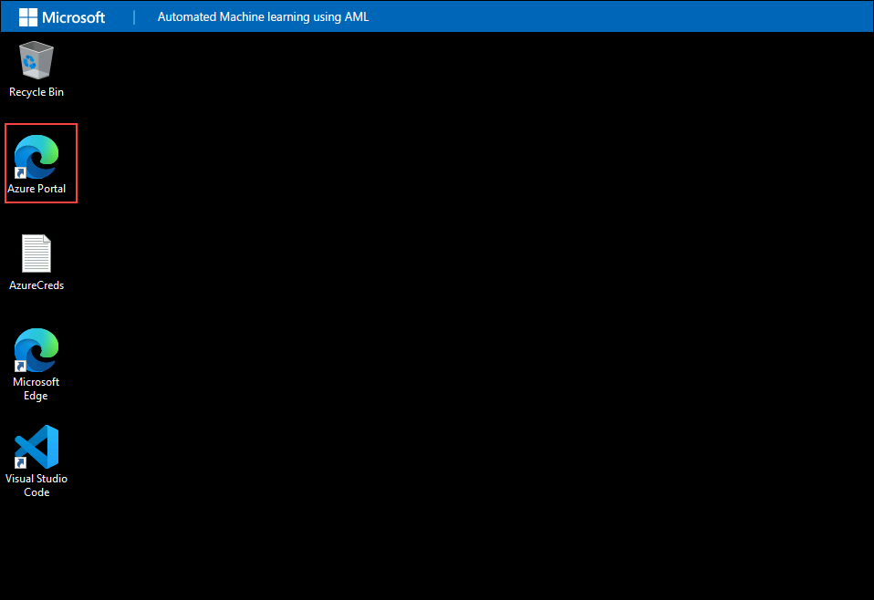
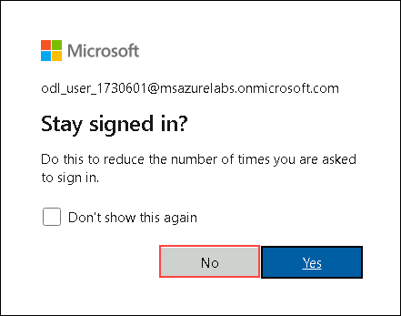
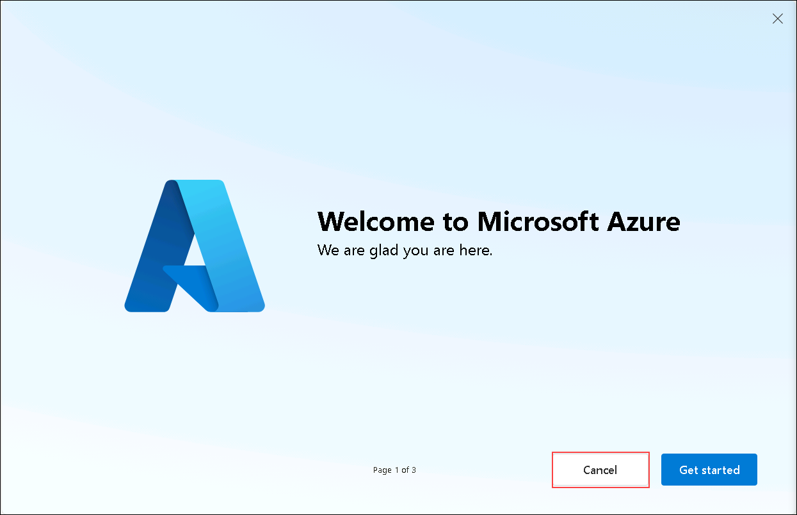

# Automated Machine learning using AML
 
### Overall Estimated Duration: 4 Hours

## Overview

In this lab, you'll explore Azure Machine Learning's capabilities by creating a workspace, setting up compute resources, and creating a dataset. You'll run an automated machine learning job to train and identify the best model, then deploy it as a predictive service. Finally, you'll test the deployed service to ensure it delivers accurate results. This lab will demonstrate how Azure Machine Learning can streamline your workflow and enhance productivity.

## Objective

Understand how to create and deploy an Azure Machine Learning workspace, set up compute resources, and create datasets. Gain skills in running automated machine learning jobs, reviewing models, and deploying predictive services. By the end of this lab, you will be able to:

- **Create and Deploy an Azure Machine Learning Workspace**: Learn how to set up a centralized hub for managing machine learning projects, including creating compute resources and datasets.
- **Run and Review Automated Machine Learning Jobs**: Understand how to train multiple models, identify the best one, and review its performance.
Deploy and Test Predictive Services: Gain the ability to deploy models as predictive services and test them to ensure they deliver accurate results.

## Pre-requisites 

Participants should have:

- Basic understanding of machine learning concepts and workflows.
- Basic knowledge of data preparation and processing techniques.

## Architecture

This architecture flow demonstrates how various Azure components work together to handle, process, analyze, and visualize data, providing a comprehensive and intelligent system tailored to business needs. You’ll start by creating an Azure Machine Learning workspace to manage resources, followed by provisioning compute resources for experiments. Next, you’ll create and register datasets, run automated machine learning jobs to identify the best model, and review model performance. The best model is then deployed as a predictive service, which is tested to ensure accuracy. This integrated approach showcases Azure’s AI and data analysis capabilities, enhancing productivity and delivering personalized experiences.

## Architecture Diagram

## Explanation of Components

The architecture for this lab involves the following key components:

- *Azure OpenAI*: This component provides access to advanced AI models from OpenAI, enabling natural language processing and other AI capabilities in applications.
- *Azure Machine Learning Workspace*: Central hub for managing machine learning resources like datasets, experiments, and models. It supports collaboration and tracks the entire ML lifecycle.
- *Compute Cluster*: A group of interconnected computers that distribute and speed up machine learning tasks. It scales dynamically based on workload.
- *Machine Learning Model*: The output of the ML process, representing learned patterns from data. It is used to make predictions or decisions based on new data.

## Getting Started with the Lab

Welcome to your Automated Machine learning using AML workshop! We've prepared a seamless environment for you to explore and learn about Azure services. Let's begin by making the most of this experience:

## Accessing Your Lab Environment

After the environment has been set up, your browser will load a virtual machine (JumpVM), use this virtual machine throughout the workshop to perform the lab. You can see the number on the bottom of the guide to switch to different exercises in the guide.

      

### Virtual Machine & Lab Guide
 
Your virtual machine is your workhorse throughout the workshop. The lab guide is your roadmap to success.

## Exploring Your Lab Resources
 
To get a better understanding of your lab resources and credentials, navigate to the **Environment** tab.

   

   > You will see the SUFFIX value on the **Environment** tab; use it wherever you see SUFFIX or DeploymentID in lab steps.

## Utilizing the Split Window Feature
 
For convenience, you can open the lab guide in a separate window by selecting the **Split Window** button from the Top right corner.

   

## Managing Your Virtual Machine
 
Feel free to start, stop, or restart your virtual machine as needed from the **Resources** tab. Your experience is in your hands!

   

## Lab Guide Zoom In/Zoom Out

To adjust the zoom level for the environment page, click the **A↕ : 100%** icon located next to the timer in the lab environment.

   

## Let's Get Started with Azure Portal

1. In the JumpVM, click on Azure portal shortcut of Microsoft Edge browser which is created on desktop.
   
      
 
   >**Note**: On the Welcome to Microsoft Edge page, select  **Start without your data**  and on the help for importing Google browsing data page, select the  **Continue without this data**  button. Then, proceed to select  **Confirm and start browsing**  on the next page

1. On **Sign into Microsoft Azure** tab you will see login screen, in that enter following email/username and then click on **Next**. 
   * Email/Username: <inject key="AzureAdUserEmail"></inject>

     
     
 1. Now enter the following password and click on **Sign in**.
    * Password: <inject key="AzureAdUserPassword"></inject>
    
     
      

      > **Note**: If prompted with MFA, please follow the steps highlighted under - [Steps to Proceed with MFA Setup if Ask Later Option is Not Visible](#steps-to-proceed-with-mfa-setup-if-ask-later-option-is-not-visible)

1. If you see the pop-up **Stay Signed in?**, click **No**

   

1. If you see the pop-up **You have free Azure Advisor recommendations!**, close the window to continue the lab.

1. If a **Welcome to Microsoft Azure** popup window appears, click **Cancel** to skip the tour.

   

1. Now you will see Azure Portal Dashboard.  
    
1. Now, click on the **Next** from lower right corner to move on next page.

## Steps to Proceed with MFA Setup if Ask Later Option is Not Visible

   > **Note:** Continue with the exercises if MFA is already enabled or the option is unavailable.

1. At the **"More information required"** prompt, select **Next**.

1. On the **"Keep your account secure"** page, select **Next** twice.

1. **Note:** If you don’t have the Microsoft Authenticator app installed on your mobile device:

   - Open **Google Play Store** (Android) or **App Store** (iOS).
   - Search for **Microsoft Authenticator** and tap **Install**.
   - Open the **Microsoft Authenticator** app, select **Add account**, then choose **Work or school account**.

1. A **QR code** will be displayed on your computer screen.

1. In the Authenticator app, select **Scan a QR code** and scan the code displayed on your screen.

1. After scanning, click **Next** to proceed.

1. On your phone, enter the number shown on your computer screen in the Authenticator app and select **Next**.
       
1. If prompted to stay signed in, you can click **No**.

1. If a **Welcome to Microsoft Azure** popup window appears, click **Cancel** to skip the tour.
 
1. Now, click on the **Next** from the lower right corner to move to the next page.

> [!IMPORTANT] 
> **For a smoother experience during the hands-on lab, it's important to thoroughly review both the instructions and the accompanying notes. This will help you navigate through the tasks with ease and confidence.**

## Support Contact

The CloudLabs support team is available 24/7, 365 days a year, via email and live chat to ensure seamless assistance at any time. We offer dedicated support channels tailored specifically for both learners and instructors, ensuring that all your needs are promptly and efficiently addressed.

Learner Support Contacts:

- Email Support: cloudlabs-support@spektrasystems.com.
- Live Chat Support: https://cloudlabs.ai/labs-support

Now, click on Next from the lower right corner to move on to the next page.

## Happy Learning!!
